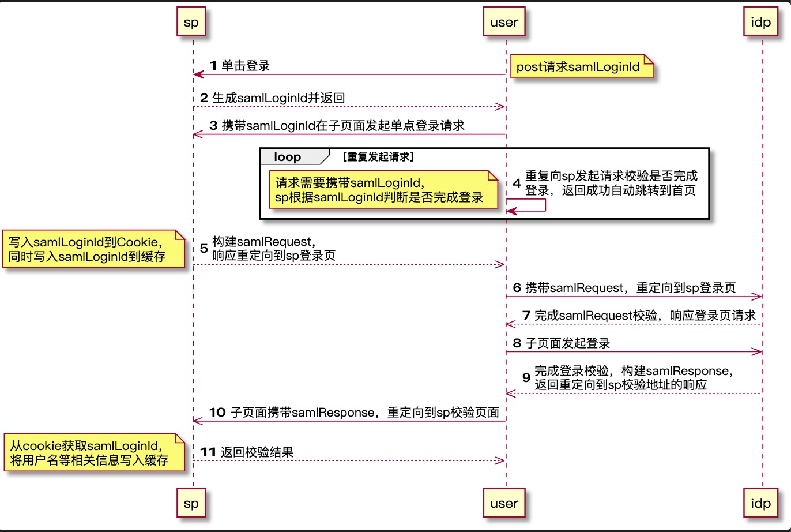

# saml-azure

## 概述

saml-azure 是在前后端分离场，且使用jwt认证场景下完成saml单点登录的尝试性解决方案。

### 说明

准备将现有的产品改造成前后端分离的实现，同时由于客户要求接入了 Azure Active Directory，并提供了基于saml2的接入方式，所以需要实现基于saml2的登录功能。

### tips
* 由于 Azure Active Directory 设置回调域名除了localhost,都需要https。所以在换用本地域名后使用了[authing](https://wwww.authing.cn)完成了后续测试。
* 注意相关配置项的更换。